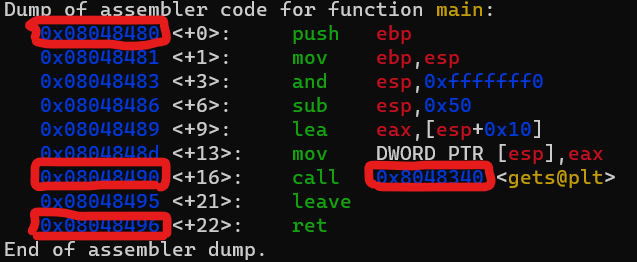
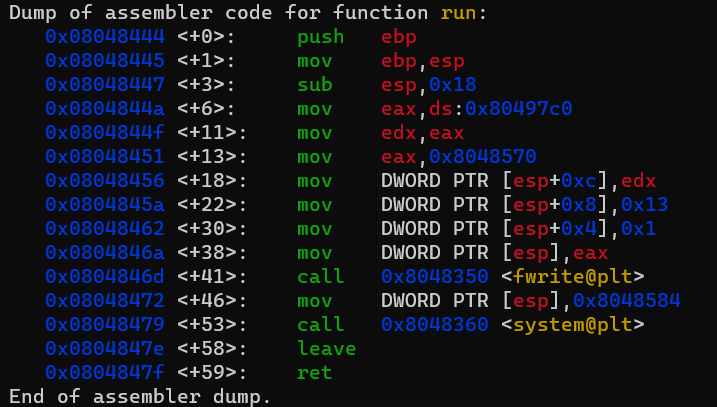

```
the main function will call the function gets() which is unsafe since it doesnt controle the size of the input.

we will be giving input to the progm till we get an idea of the size of the buffer variable that was passed to gets to store our iput, our goal here is to overflow the buffer
```


```
the run() function was never called in the program but was bundled in the compiled program so it has a starting address in the global memory allocated when the program was executed
```


```
AAAAAAAAAAAAAAAAAAAAAAAAAAAAAAAAAAAAAAAAAAAAAAAAAAAAAAAAAAAAAAAAAAAAAAAAAAAA + adress of the run function so we can overflow the value of the EIP with adress of our function so it gets executed unstead of exiting the main function

we have litle indian addressing so we should reverse our input the adress of the run function is : 0x08048444

using python -c "print('A' * 76 + '\x44\x84\x04\x08')"
```