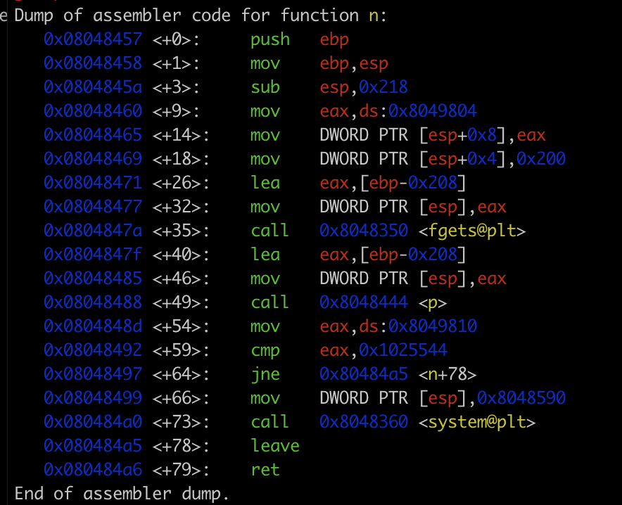

```
https://axcheron.github.io/exploit-101-format-strings/
```

objdump -t ./level4 | grep "m"   <-> address of the variable m in the bss section

0x8049810  -> address of variable m
0x1025544 -> 16930116 in decimal

0x0102 -> 258 in decimal -> at 0x1980408 + 2 = 0x198040A
0x5544 -> 21828 -> at 0x1980408

lets break it :

- i want to write the value 0x1025544(16930116 in decimal) in the variable m (0x8049810)
- 0x0102 (258 in decimal) at address 0x8049812 (0x8049810 + 2) 
- 0x5544 (21828 in decimal) at address 0x8049810


```
lets check the binary using gdb
```

```
main is doing a simple call to the n() funtion at the address 0x8048457

lets disassemble it
```

```
the function n() takes user input and pass it to the function p()
the funtion p() print it back using printf() whitout using format string we can start printing values from the stack 
```
