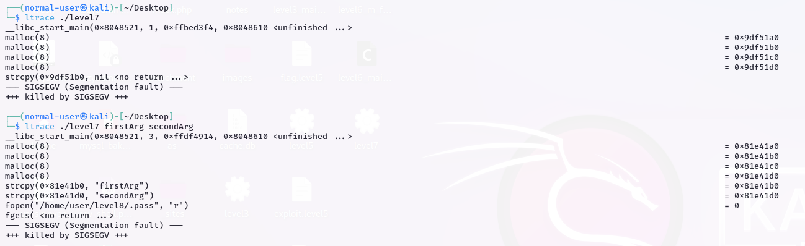

```
the program has a function m() that was never used that print the content of a variable c
the program is allocating 3 times 8 bits.
We can see that in the main function the program retrieve the flag with fgets() and saves it in a global variable c but does nothing with it.

we will try to override the adress of puts function in the global offset table

we can find the adress of the puts and m function easly as we did befor then construct our payload

./leve7 $(python -c 'print "A" * 20 + "\x28\x99\x04\x08"') $(python -c 'print "\xf4\x84\x04\x08"')

```